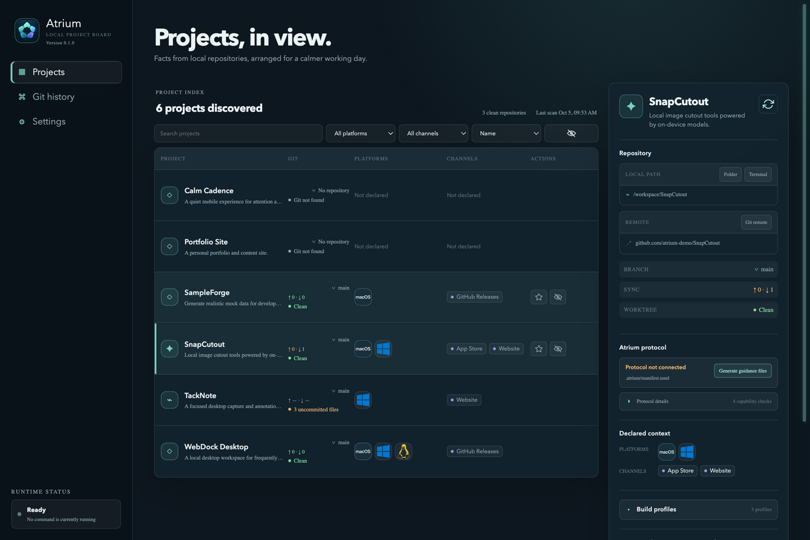

# Atrium

English | [简体中文](README.zh-CN.md)

[](https://github.com/iron90/Atrium/actions/workflows/quality.yml)
[](LICENSE)



Atrium is a visual project board for the projects on your machine, built for
independent software studios. It scans your workspace, reads each project's own
`.atrium/manifest.toml` declarations, and arranges the facts — Git state,
platform and channel context, storage, build profiles, run history — into one
view, without imposing a project lifecycle or replacing the repository's own
development workflow. The app is Tauri 2: a React/TypeScript UI on a Rust
native core, and the interface ships in English and Chinese.

## Projects

The Projects page lists every repository discovered in your workspaces:

- Search, filter by platform or channel, and sort by name, Git state, recency, or storage size.
- Favorite and hide projects; hiding only affects the board, never the files.
- Open a project's folder, terminal, remote, and declared links from its row.
- Workspaces refresh automatically every 10 seconds, and the list updates only when something changed; the selected project can also be refreshed on demand.

Selecting a project opens the project detail card, top to bottom:

- **Repository** — local path, remote, checked-out branch, upstream sync counts, and working-tree state; a read-only branch picker views another branch's history without checking it out.
- **Atrium protocol** — capability status read from `.atrium/manifest.toml`, plus one-click guidance files and a copyable prompt for the project's development agent.
- **Declared context** — the platforms and channels the project declares.
- **Storage** — project size and cleanable entries with per-entry selection; cleanup only ever touches directories the manifest declares.
- **Build profiles** — the project's own Check / Build / Run bindings, with inspection of the build artifacts each profile explicitly declares.
- **Discovered repository commands** — commands found in the repository itself, shown only after explicit confirmation.
- **Live output** — start a bound action and watch its output and final result here.
- **Persistent run history** — finished runs are recorded locally with project, profile, platform, channel, and Git context; logs stay openable and copyable.
- **Recent commits** — the loaded history, plus ahead/behind counts for the viewed branch.

Which of these sections appear at all is up to you — each one has a switch on the Settings page.

## Git history

Pick a project, enter a commit, branch, or tag range, and read the commit and
file-change summary between the two revisions; the summary copies out as
structured JSON.

## Settings

- **Workspaces** — add, edit, and remove the folders Atrium scans, with deterministic exclusion names; scanning lives here and nowhere else.
- **Appearance** — three themes, two layouts, and the English/Chinese interface switch.
- **Project detail card** — one switch per detail-card section.

## Download

Download the macOS and Windows installers from
[GitHub Releases](https://github.com/iron90/Atrium/releases). The artifacts are
not signed by Apple: on macOS, the first launch may report the app as damaged —
run `xattr -rd com.apple.quarantine /Applications/Atrium.app` once to allow it;
on Windows, SmartScreen shows a one-time warning.

## Development

Requirements: Node.js 24 (see `.nvmrc`) and Rust 1.97.1 (pinned in
`rust-toolchain.toml`).

```sh
npm install
npm run dev
```

For a browser-only UI preview:

```sh
npm run dev:web
```

The browser preview renders deterministic demo data; it does not scan real
repositories.

`npm run quality` runs formatting, typecheck, lint, unit tests, the frontend
build, and the Rust format/test/clippy gates — the same set the CI workflow
enforces on every push.

`scripts/generate-icon.swift` regenerates `src-tauri/icons/icon.png` on macOS.

## Documentation

- [docs/ARCHITECTURE.md](docs/ARCHITECTURE.md) — architecture and persistence boundaries.
- [docs/ATRIUM_PROTOCOL.md](docs/ATRIUM_PROTOCOL.md) — the integration contract a project adopts so the board can read it.
- [AGENTS.md](AGENTS.md) — implementation guardrails for coding agents.

## License

[MIT](LICENSE)
